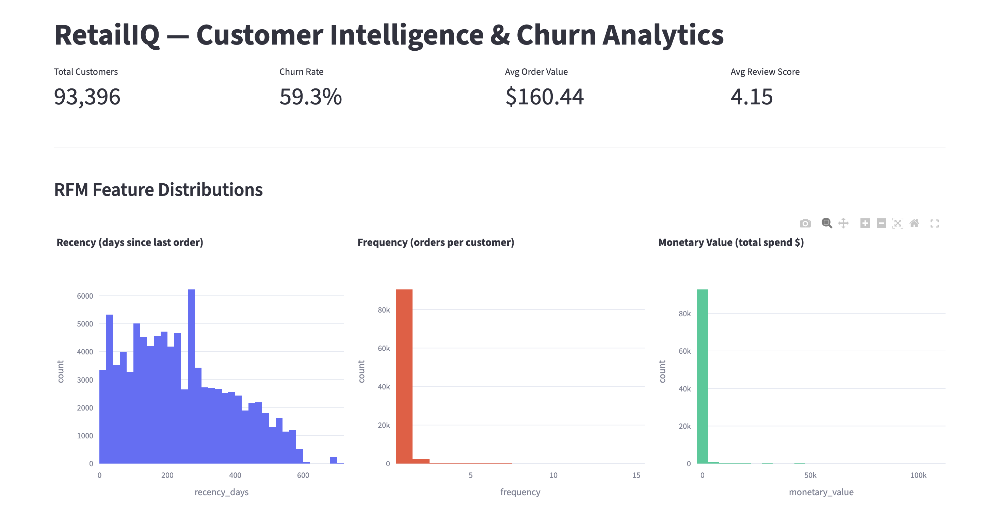
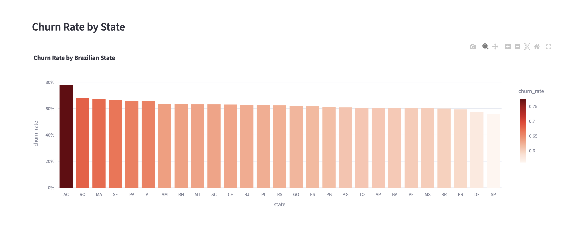
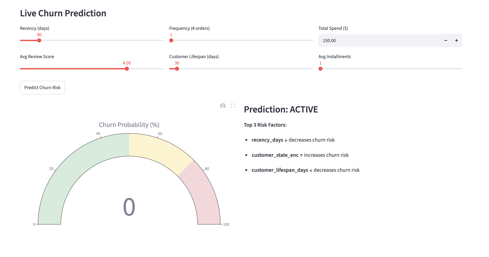

# RetailIQ — E-Commerce Customer Intelligence & CLV Prediction Platform

A production-grade customer analytics platform built on a modern data stack.
Ingests 100K+ e-commerce orders into Snowflake, engineers RFM features via dbt,
trains XGBoost/LightGBM churn classifiers tracked with MLflow, and serves
predictions through a Dockerized FastAPI service with a Streamlit executive dashboard.


## Tech Stack

| Layer | Tools |
|-------|-------|
| Data Warehouse | Snowflake |
| Data Transformation | dbt |
| ML & Modeling | Python, XGBoost, LightGBM, Scikit-learn, SHAP, Optuna |
| Experiment Tracking | MLflow |
| API | FastAPI, Uvicorn |
| Containerization | Docker |
| Dashboard | Streamlit, Plotly |
| Data Processing | Pandas, NumPy |


## Features

- **End-to-end data pipeline** — raw CSVs → Snowflake → dbt → ML-ready features
- **RFM Feature Engineering** — Recency, Frequency, Monetary segmentation via dbt
- **Churn Prediction** — XGBoost and LightGBM classifiers with class-imbalance handling
- **Experiment Tracking** — Full MLflow logging with Model Registry
- **SHAP Explainability** — Feature importance and per-customer risk factor explanations
- **REST API** — Dockerized FastAPI endpoint returning churn probability + top 3 risk factors
- **Executive Dashboard** — Live Streamlit app with KPIs, RFM distributions, churn by state, and interactive prediction widget


## Dataset

[Olist Brazilian E-Commerce](https://www.kaggle.com/datasets/olistbr/brazilian-ecommerce)
— 9 relational tables, 100K+ orders across 2016–2018


## Model Results

| Model | ROC-AUC |
|-------|---------|
| XGBoost | 0.86 |
| LightGBM | 0.86 |

**Top churn drivers (SHAP):**
1. `recency_days` — days since last purchase (dominant predictor)
2. `avg_order_value` — average spend per order
3. `monetary_value` — total customer lifetime spend

## Screenshots

### Executive Dashboard


### Churn Rate by State


### Live Prediction Widget



## API Usage

Start the prediction service:
```bash
uvicorn api.main:app --reload
```

## Author

**Shreya Pandey**
MSBA, Northeastern University (Dec 2026)
[LinkedIn](https://linkedin.com/in/shreya-pandey-672a9722b) | [GitHub](https://github.com/shreya2622)